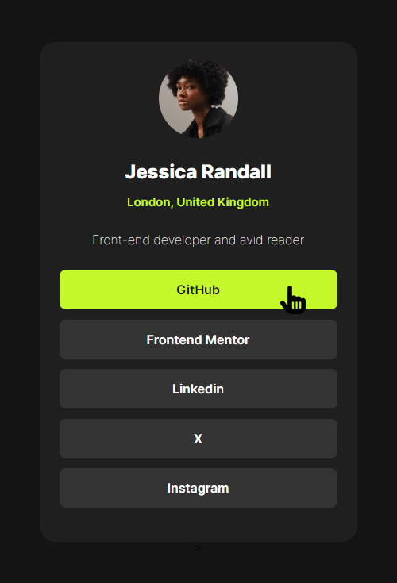

# Frontend Mentor - Social links profile solution

This is a solution to the [Social links profile challenge on Frontend Mentor](https://www.frontendmentor.io/challenges/social-links-profile-UG32l9m6dQ). Frontend Mentor challenges help you improve your coding skills by building realistic projects.

## Table of contents

- [Overview](#overview)
  - [Screenshot](#screenshot)
  - [Links](#links)
- [My process](#my-process)
  - [Built with](#built-with)
  - [What I learned](#what-i-learned)
  - [Continued development](#continued-development)
  - [Useful resources](#useful-resources)
- [Author](#author)
- [Acknowledgments](#acknowledgments)

**Note: Delete this note and update the table of contents based on what sections you keep.**

## Overview

### Screenshot



### Links

- Solution URL: (https://github.com/Junbol-Frontend-Mentor/HTML_CSS_social-links-profile)
- Live Site URL: (https://junbol-frontend-mentor.github.io/HTML_CSS_social-links-profile/)

## My process

### Built with

-Semantic HTML5 markup
-CSS custom properties
-Flexbox
-Mobile-first workflow
-GIT/GitHub
-PowerShell Command line

### What I learned

```css
.button {
  display: flex;
  justify-content: center;
  align-items: center;
  width: 350px;
  height: 50px;
  font-family: 'Inter', sans-serif;
  font-size: 16px;
  font-weight: 600;
  color: var(--color-white);
  border-radius: 8px;
  background-color: var(--color-gray);
  transition-duration: 2000ms;
  transition-timing-function: ease;
}

.button:hover {
  background-color: var(--color-green);
  cursor: url(../assets/images/hand-pointer-solid.svg), pointer;
  color: var(--color-of-black);
}

.photo {
  width: 100px;
  height: 100px;
  border-radius: 50%;
  background-image: url(../assets/images/avatar-jessica.jpeg);
  background-repeat: no-repeat;
  background-size: cover;
  margin-bottom: 2rem;
  transition-duration: 2000ms;
  transition-timing-function: ease;
}

.photo:hover {
  transform: scale(1.2); /* Scale up the photo by 10% on hover */
  cursor: url(../assets/images/hand-pointer-solid.svg), pointer;
  border: 2px solid greenyellow;
}
```

### Continued development

I would like to continue studying CSS animation, transitions and FX like parallax.

### Useful resources

- [web.dev](https://web.dev/learn/css) - This helped me for get back on track with CSS.
- [w3schools](https://www.w3schools.com/css/default.asp) - The one place to refresh stuff in practical way.

## Author

- Website - [Junier Bolivar](https://www.bolivarcreativedesign.com)
- Frontend Mentor - [Junbol](https://www.frontendmentor.io/profile/Junbol)
- Twitter - [@JunierBolivar](https://www.twitter.com/@JunierBolivar)

## Acknowledgments
